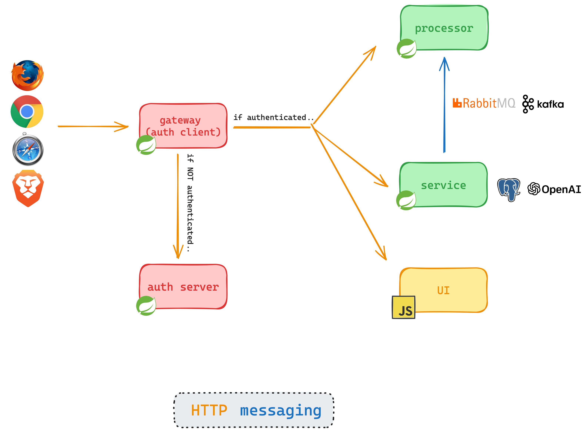

# SpringOne 2024 Top Secret Demo

By Josh Long, Cora Iberkleid, and Dr. Mark Pollack 

Hi, Spring fans! Let's build something awesome for SpringOne 2024.

## to run 
* start docker containers and load db data (use `init_db.sh`)
* start the `auth-service`
* start the `processor`
* start the `gateway`
* start the `service`
* start the `ui` (use `run.sh`)

## to test
* access the gateway at http://127.0.0.1:1010, this will redirect you to the UI for login
* log in using josh/secret or cora/secret - shhh... don't share the password!
* click to adopt the dog of your choice - beware the neurotic Prancer!

If you comment out the `oauth2-resource-server` in `service/pom.xml`, then you can also test the service app directly using:
```
curl -d'{"name":"Cora"}' -XPOST -H"content-type: application/json" http://localhost:8080/dogs/45/adoptions
```

## architecture

Spring's **_Pooch Palace Dog Adoption Agency_** Architecture

* `gateway` - the first port of call for requests intended for our system
* `ui` -  HTML and JavaScript application 
* `service` - supports finding and adopting dogs.
* `processor` - a legacy system that is involved in the adoption process.
* `auth-service` - a Spring Authorization Server instance  


 

[the diagram is here](https://app.excalidraw.com/s/8cEzXyZLwI/2nTNOK37O8e)

## this has been a whirlwind tour of all things Spring

To recap, we've covered:

* **Spring Boot 3.3** - the runtime sensation that's sweeping all nations
* **Spring Data JDBC** - you've got data, and we've got you covered
* **Spring Modulith** - we heard you like modules so we put some modularity in your modules 
* **Spring AI** (new and improved, now with RAG support!) - to build the assistant
* **Spring Integration** - making friends since 2007 
* **Spring Authorization Service** -  your one-stop-shop for all things authentication and authorization 
* **Spring Gateway** - handle cross-cutting network concerns with ease, aplomb, and alacrity


## Beats
- We wanted a theme for our keynote but didnt want to rehash the tired old Spring Petclinic example. but we do like pets
- Let’s build a pet adoption agency 
- Who doesn’t like dogs? 
- I love dogs. I have a dog. Hes terribad. Reminds me of Prancer. 
- All dogs, even the bad ones, deserve a good home
- start.spring.io GraalVM, Web, Data JDBC, PGVector, OpenAI, Modulith, AMQP, and OAuth Resource Server, etc. 
- go to build and comment out the Resource Server dependency 
- specify SQL DB connectivity credentials 
- Add a package for adoptions 
	- Build a controller that lets you post to update the `owner` field of the `Dog` to reflect the new owner 
- We finished this but there's a lot of work involved in adopting a dog. We need to update other modules. 
- Let’s build a  kennel service. 
- demo `ApplicationModulelistener`
- We can enable republished events and initialize the schema. Watch. Now we publish the event and then pull the plug on the machine and the event is republished 
- Nice! We have a well structured system. 
	- We can ensure it stays that way using ApplicationModules.verify()., Aldo get living documentation with` Documenter(ApplicationModules)`
- We publish the message to another module in the same codebase. But what if the kennel service was actually a different microservices? It’s an older Spring Boot module using 2.7 and Spring Integration. 
- Easy. Add `@Externalized` to the message ad then add the requisite `amqp` or `kafka` starter 
	- Make sure `Externalized#target` points to the destination in the broker 
	- Nice! The other service got the message. Although, looking at it, it’s using the creakingly ancient Java 17 and Spring Boot 2.7. Something will have to be done about that… 
	- OH WELL. for another time, surely. 
- Anyway! We were able to adopt prancer. But we knew his ID. It’s 45. How is someone else to find him? 
- We need an assistant to help find him 
- Spring AI to the rescue 
- Dr. Pollack enters the chat and gives us a brief overview of the history of AI (and scares off a smelly Python developer or something lol)
- Define the `ChatClient` 
- Give it a user prompt. AI responds "im an AI, we dont have pets." 
- Give it a system prompt about being an assistant at Springs Pet emporium . AI responds with a disappointed message, but at least it sounds like it should be able to do this job.
- `VectorStore`s 
- introduce the RAG pipeline (`QuestionAnswerAdvisor`) 
- Nice! It found Prancer, but how is the rest of the program to work with this news? 
- introduce output mapping and schema.  (`DogAdoptionSuggestion.class`)
- I would also love it if the LLM could schedule a pick up time (the new function support gets used here) 
